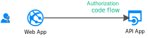

# Secure a .NET Framework web app (OWIN) with authorization code grant flow and Id token

You add authentication to your Web App, which can therefore sign in users and calls a web API on behalf of the signed-in user.

Web Apps that calls web APIs:

- Are confidential client applications (can store confidential data on the server).
- That's why they've registered a secret (application password or certificate) with Azure AD B2C. This secret is passed-in during the call to Azure AD B2C to exchange the authorization code to an access token.

## Prerequisites

You need the following resources in place before continuing with the steps in this article:

- [Azure AD B2C tenant](tutorial-create-tenant.md)
0- [Application registered](tutorial-register-applications.md) and create a **client secret** for your application.
- [User flows](tutorial-create-user-flows.md), or [custom policies](https://docs.microsoft.com/en-us/azure/active-directory-b2c/active-directory-b2c-get-started-custom?tabs=applications) are create in your tenant.
- [Configure scopes](https://docs.microsoft.com/en-us/azure/active-directory-b2c/add-web-application?tabs=applications) and Grant permissions:
    - `demo.read` - Read access to the web API
    - `demo.write` - Write access to the web API

## How it works
Given that letting a user sign in is delegated to the Open ID connect (OIDC) middleware, you want to hook-up in the OIDC process. The way to do that is different depending on the framework you use. In the case of ASP.NET, you'll subscribe to middleware OIDC events. The principle is that:

- You'll let ASP.NET request an authorization code, through the Open ID connect middleware. By doing this ASP.NET will let the user sign in with Azure AD B2C sign-in policy.
- You'll subscribe to the reception of the authorization code by the Web app. This is a C# delegate.
- When the auth code is received, you'll use MSAL libraries to redeem the code. The resulting access tokens and refresh tokens are, then, stored in the token cache. From there, the cache can be used in other parts of the application, for instance in controllers, to acquire other tokens silently.
- Your application will use following tokens:
    - The **Id token** is used to secure the web application itself.
    - The **access token** is used to secure the call to the REST API
    - The **refresh token** is used to acquire new access token (after the access token is expired)
