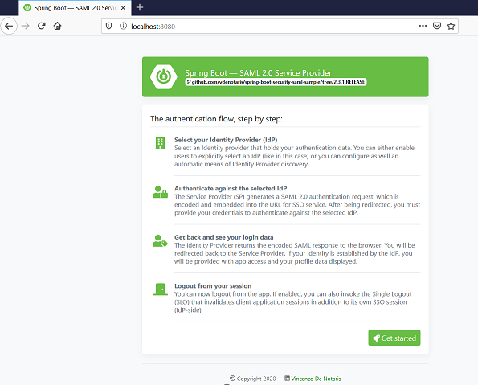
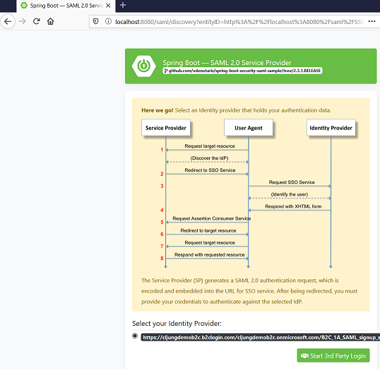
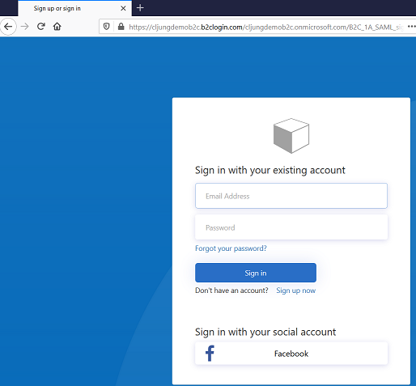
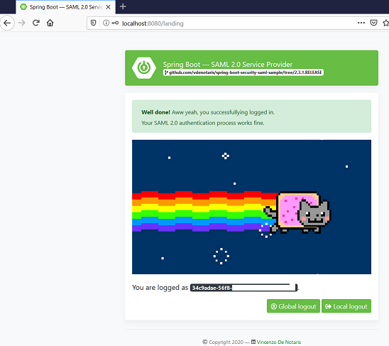

# Secure a Java SpringBoot WebApp with SAML and Auzre AD B2C

This is a description for how you migrate a Java Spring Boot webapp that uses SAML for authentication to use Azure AD B2C as the Identity Provider. The sample Java Spring Boot webapp used has nothing to do with Microsoft and using it is part of the point since it proves that B2C can be integrated with a webapp that was written without Microsoft, Azure or B2C in mind.

## Prerequisites
In order to build this sample, you need to have a Azure AD B2C tenant available and a computer with docker installed.

## Step 1 - SAML Apps in Azure AD B2C
The first step is to follow the documentation for how to [register a SAML application in Azure B2C](https://docs.microsoft.com/en-us/azure/active-directory-b2c/connect-with-saml-service-providers). The documentation will also guide you how to create a B2C Custom Policy that emits SAML tokens and to test it with a Microsoft provided SAML Test Application.

You can not skip this step.

## Step 2 - Download and build the Java Spring Boot webapp

To download and build the sample, run the following commands. The Maven based build of the will take a few minutes, but should be fully automatic.

```bash
git clone https://github.com/vdenotaris/spring-boot-security-saml-sample.git

docker build -t spring-saml-sp:v1.0 .
docker run -it --rm -p 8080:8080 -t spring-saml-sp:v1.0
```

At this point you can open the browser and navigate to [http://localhost:8080/](http://localhost:8080/) and start the signup/signin process. The webapp uses [ssocircle](https://www.ssocircle.com/en/) as its default Identity Provider. In order to sign up you need a working e-mail since it will send an e-mail with an activation link. 

Ctrl+C to stop the running docker image.

## Step 3 - Code changes for B2C

### WebSecurityConfig.java

Open the local file [WebSecurityConfig.java](https://github.com/vdenotaris/spring-boot-security-saml-sample/blob/master/src/main/java/com/vdenotaris/spring/boot/security/saml/web/config/WebSecurityConfig.java) in an editor and make the following three changes. The first change is to point the webapp to the SAML metadata of the Azure AD B2C Custom Policy you created in step 1. Please note you need to change the names ***yourtenant*** and ***your-policy-name*** to your own names.

```java
//String idpSSOCircleMetadataURL = "https://idp.ssocircle.com/meta-idp.xml";
String idpSSOCircleMetadataURL = "https://yourtenant.b2clogin.com/yourtenant.onmicrosoft.com/B2C_1A_your-policy-name/samlp/metadata";
```

The second change is due to we haven't completed all things with SAML and certificates, so we disable that check
```java
//extendedMetadataDelegate.setMetadataTrustCheck(true);
extendedMetadataDelegate.setMetadataTrustCheck(false);
```

The third and last change is to update the EntityID that we send in the SAML AuthnRequest message
```java
//metadataGenerator.setEntityId("com:vdenotaris:spring:sp");
metadataGenerator.setEntityId("http://localhost:8080/saml/SSO"); 
```

With these changes saved, you are ready to build a new version of the app

```bash
docker build -t spring-saml-sp:v2.0 .
docker run -it --rm -p 8080:8080 -t spring-saml-sp:v2.0
```

## Step 4 - Update the App manifest

The Manifest of the App Registration in Azure AD B2C needs to be updated in order for the webapp to work. First the webapps own manifest need to be made available to Azure AD B2C. Open the browser and navigate to [http://localhost:8080/saml/metadata](http://localhost:8080/saml/metadata) and save the response to a local XML file.

One way of hosting your manifest in a way that B2C can reach it is by storing in in Azure Blog Storage that is made public. How you configure a storage account for that is  [documented here](https://docs.microsoft.com/en-us/azure/active-directory-b2c/custom-policy-ui-customization#hosting-the-page-content) in section ***Create an Azure Blob storage account***.

In the Manifest of the App Registration, locate the ***samlMetadataUrl*** attribute and add the url to your manifest file. Please not that you need to change ***yourstorageaccountname*** and ***mycontainername*** to the names you selected.

```JSON
"samlMetadataUrl": "https://yourstorageaccountname.blob.core.windows.net/mycontainername/spring_saml_metadata.xml"
```

Update the attribute ***identifierUris*** to match the change you did in the WebSecurityConfig.java file for the EntityID 
```JSON
	"identifierUris": [
		...,
        "http://localhost:8080/saml/SSO"
	],
```
Save the Manifest

## Step 5 - Run the webapp and signin using B2C

Open the browser and navigate to [http://localhost:8080/](http://localhost:8080/) and press the ***Get Started*** button. Select your B2C SAML Policy and press ***Start 3rd Party Login***

 

Complete the B2C Signup/Sign in page. If you already have users in your tenant you can sign in as any of them.
 

After the signin is completed, the webapp returns to its homepage and the users objectId is displayed on the page as the Java sample uses the NameID attribute to display there, which for B2C is the user's objectId.

You have successfully migrated a Java Spring Boot webapp to use Azure AD B2C as it's SAML Idp!
