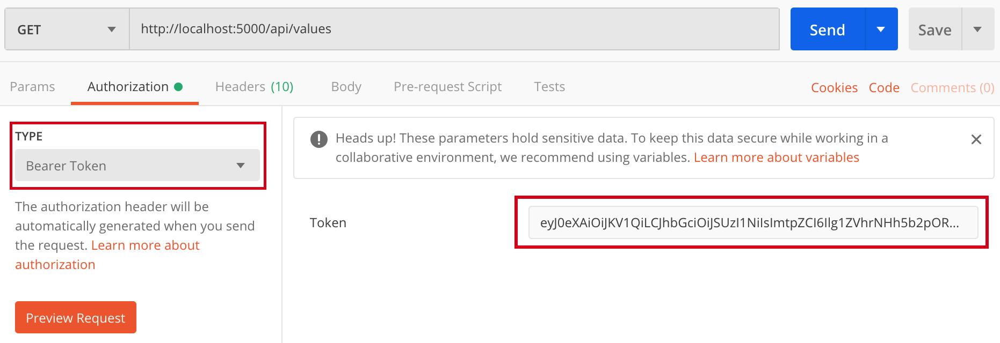

# Secure a Node.js web API 

[Node.js](https://nodejs.org/en/) supports creating RESTful services, also known as [web APIs](https://docs.microsoft.com/en-us/aspnet/web-api/), using C#. Learn how to restrict access to your ASP.NET Framework web API to clients that have authenticated with Azure Active Directory B2C (Azure AD B2C).

## Prerequisites

You need the following resources in place before continuing with the steps in this article:

* [Azure AD B2C tenant](tutorial-create-tenant.md)
* [Application registered](tutorial-register-applications.md) in your tenant
* [User flows created](tutorial-create-user-flows.md) in your tenant
* [Postman](https://www.getpostman.com/) to test secured access (optional)

## Get Azure AD B2C application ID

When you secure an web API with Azure AD B2C, you need to specify the list of apps (web/mobile SPA applications) that are allow to acess the web API. First, record the application ID of an application you've previously created in your Azure AD B2C tenant. If you're using the application you created in the prerequisites, use the application ID for *webbapp1*.

1. Browse to your Azure AD B2C tenant in the [Azure portal](https://portal.azure.com).
1. Under **Manage**, select **Applications**.
1. Record the value in the **APPLICATION ID** for *webapp1* or another application you've previously created.

  

## Get token metadata endpoint

Next, get the well-known config URL for one of your Azure AD B2C user flows. 

1. Browse to your Azure AD B2C tenant in the [Azure portal](https://portal.azure.com).
1. Under **Policies**, select **User flows (policies)**.
1. Select an existing policy, for example *B2C_1_signupsignin1*, then select **Run user flow**.
1. Record the URL in hyperlink displayed under the **Run user flow** heading near the top of the page. This URL is the OpenID Connect metadata endpoint for the user flow, and you use it in the next section when you configure the authentication middleware.

    


## Setup your web API

## 1. Create a web API project

Let's get started by creating the simplest Node.js application, "TodoApi".

Create an empty folder called "hello", navigate into and open VS Code:

```console
mkdir TodoApi
cd TodoApi
code .
```

## 2. Install dependencies

Under the root **TodoAPi** folder, add  **package.json** file, copy following content>

```JSON
{
  "name": "backend-nodejs",
  "version": "1.0.0",
  "description": "",
  "author": "",
  "license": "ISC",
  "engines": {
    "node": ">=6.9.1"
  },
  "scripts": {
    "start": "node index.js"
  },
  "dependencies": {
    "express": "^4.14.0",
    "morgan": "^1.7.0",
    "passport": "^0.3.2",
    "passport-azure-ad": "^3.0.4"
  }
}
```

Save the **package.json** file and fun following command to install the dependencies:

```console
npm install
```

You first need to install dependencies in your project:

* [express](https://www.npmjs.com/package/express): Minimalist web framework for node.
* [morgan](https://www.npmjs.com/package/morgan): HTTP request logger middleware for node.js.
* [passport](https://www.npmjs.com/package/passport): authentication middleware for Node.js
* [passport-azure-ad](https://www.npmjs.com/package/passport-azure-ad):  A collection of [Passport](https://www.npmjs.com/package/passport) Strategies to help you integrate with Azure Active Directory. Run following command:


## 3. Create an index.js file

From the File Explorer toolbar, press the **New File** button, and name the file **app.js**, and add the following code:

```JS
var express = require("express");
var morgan = require("morgan");
var passport = require("passport");
var BearerStrategy = require('passport-azure-ad').BearerStrategy;

// TODO: Update the OpenId Connect metadata endpoint URI, and application ID
var identityMetadata = "https://sunflowersdemo.b2clogin.com/sunflowersdemo.onmicrosoft.com/v2.0/.well-known/openid-configuration?p=B2C_1_susi_v2"
var clientID = "0239a9cc-309c-4d41-87f1-31288feb2e82";

// Initializing express.js
var app = express();
app.use(morgan('dev'));

// Set CORS, so the REST API can be called from different domain 
app.use(function (req, res, next) {
    res.header("Access-Control-Allow-Origin", "*");
    res.header("Access-Control-Allow-Headers", "Authorization, Origin, X-Requested-With, Content-Type, Accept");
    next();
});

// Authentication with passport options
var options = {
    identityMetadata: identityMetadata,
    clientID: clientID,
    validateIssuer: true,
    loggingLevel: 'info',
    passReqToCallback: false
};

// Initialize the passport-azure-ad
var bearerStrategy = new BearerStrategy(options,
    function (token, done) {
        // Send user info using the second argument
        done(null, {}, token);
    }
);

app.use(passport.initialize());
passport.use(bearerStrategy);


// api/values GET endpoint, protected with oauth bearer token
app.get("/api/values",
    passport.authenticate('oauth-bearer', {session: false}),
    function (req, res) {
        res.status(200).json(["Value1", "Value2"]);
    }
);


var port = process.env.PORT || 5000;
app.listen(port, function () {
    console.log("Listening on port " + port);
});
```

The following section describes the above code.

1. The index.js file starts with including the dependencies. Note: also you already installed the dependency, in this section you tell Node.js to include them in your class.
1. Next you need to set the value of the `identityMetadata` with your Azure AD B2C metadata endpoint URI. And set the `clientID` wht your application ID.
1. The `options` variable is set with the options to initialize the passport-azure-ad authentication middleware.
1. The the code initialize the passport and the passport-azure-ad middleware 
1. The `app.get("/api/values"` is the GET endpoint that is protected with oauth bearer token.


## 4. Protect the API endpoints

Every method (endpoint) that need to be protected must include the `passport.authenticate` function. For example:

```JS
app.get("/api/values",
    passport.authenticate('oauth-bearer', {session: false}),
    function (req, res) {
        res.status(200).json(["Value1", "Value2"]);
    }
);
```

## 5. Validate secure API access

To ensure only authenticated callers can access your API, you can validate your web API configuration by calling the API with [Postman](https://www.getpostman.com/). To call the API, you need an access token issued by Azure AD B2C.

### Get an access token

You first need a token issued by Azure AD B2C to use in the `Authorization` header in Postman. You can get one by using the **Run now** feature of your sign-up/sign-in user flow you should have created as one of the prerequisites.

1. Browse to your Azure AD B2C tenant in the [Azure portal](https://portal.azure.com).
1. Under **Policies**, select **User flows (policies)**.
1. Select an existing sign-up/sign-in user flow, for example *B2C_1_signupsignin1*.
1. For **Application**, select *webapp1*.
1. For **Reply URL**, choose `https://jwt.ms`.
1. Select **Run user flow**.

    

1. Complete the sign-in process. You should be redirected to `https://jwt.ms`.
1. Record the encoded token value displayed in your browser. You use this token value for the Authorization header in Postman.

    


### Test a secure API call

With the access token recorded, you're now ready to test whether you've correctly configured secure access to the API.

1. Create a new `GET` request in [Postman](https://www.getpostman.com/). For the request URL, specify the speakers list endpoint of the API you published as one of the prerequisites. For example:

    `http://localhost:5000/api/values`

1. Next, select **Authorization**. From the **Type** select **Bearer**, and provide your access token.
    Your **GET** request URL and **Authorization** should appear similar to:

    

1. Select the **Send** button in Postman to execute the request. If you've configured everything correctly, you should be presented with a JSON response with a collection of conference speakers (shown here truncated):

    ```JSON
    [
        "value1",
        "value2"
    ]
    ```

### Test an insecure API call

Now that you've made a successful request, test the failure case to ensure that calls to your API with an *invalid* token are rejected as expected. One way to perform the test is to add or change a few characters in the token value, then execute the same `GET` request as before.

1. Add several characters to the token value to simulate an invalid token. For example, add "INVALID" to the token value:

1. Select the **Send** button to execute the request. With an invalid token, the expected result is a `401` unauthorized status code.

If you see the `401` status code, you've verified that only callers with a valid access token issued by Azure AD B2C can make successful requests to your web API.

## 6. [Optional] Add authorization

Authorization refers to the process that determines what a user is able to do. For example, only users who sign-in with a policy that requires MFA (multi factor authentication) have access to a certain endpoint or actions. By checking the value of a claim, you can verify that the token issued by a specific policy.

The following example evaluates the `tpf` (policy name) claim,  whether the access token policy name mach the action policy name set to the endpoint or action.

```JS
app.get("/api/values",
    passport.authenticate('oauth-bearer', {session: false}),
    function (req, res) {
        var claims = req.authInfo;
        if (claims['tfp'] != "B2C_1_susi_with_MFA") {
            res.status(403).json({'error': 'insufficient permissions'});
        }
        res.status(200).json(["Value1", "Value2"]);
    }
);
```
